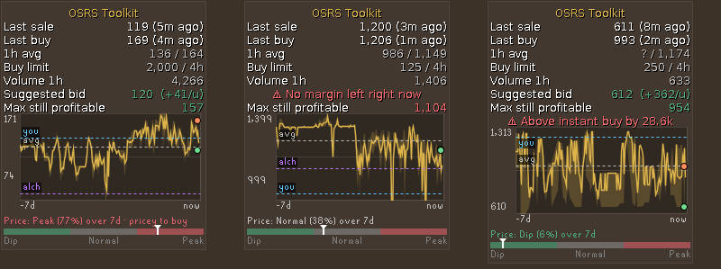
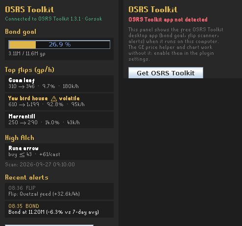

# OSRS Toolkit Panel

A RuneLite plugin that helps you **see** whether a Grand Exchange price is a good deal before you confirm it.



## GE price helper (off by default)

Open a GE offer (new or existing) and a small box shows:

- **Last sale / last buy**: the last real instant-sell and instant-buy trades, and how long ago they happened
- **1h averages, buy limit, 1h volume**
- **Suggested bid**: just above the last accepted price, with your profit per item after the 2% GE tax
- **Max still profitable**: the highest buy price that still leaves your minimum margin (2% by default)
- **Warnings**: price above the instant buy, below the instant sell, above the profitable max, stale prices, or room to bid higher
- **Price chart** (24h / 7d / 30d): buy/sell band, your offer, the period average, the High Alch floor and the last trades
- **Dip / Normal / Peak gauge**: where the current price sits in its usual range for the period

Prices come from the [OSRS Wiki real-time prices API](https://prices.runescape.wiki/). Because that is a third-party
server, the helper is **disabled by default**: enable it in the plugin settings (*GE price helper → Enable*).

## OSRS Toolkit side panel (optional)



If you also run the free [OSRS Toolkit](https://github.com/Gorsokk/osrs-toolkit) desktop app, the side panel shows:

- your progress toward a bond (also as an infobox)
- the app's top flips and High Alch picks, sized to your cash
- its recent alerts, and new important alerts in the game chat

The plugin reads the app on your own computer (`127.0.0.1`, port 8765 by default) with read-only requests.
Without the app, the panel simply says it isn't detected; the GE price helper works on its own.

## Settings

*Language* (English / Français) · *GE price helper*: enable, chart on/off, chart range, minimum margin ·
*OSRS Toolkit app*: port, refresh interval, bond infobox, chat alerts.

## Privacy

Nothing about your account is sent anywhere. The GE helper only requests public item prices from the OSRS Wiki
(when enabled); the side panel only talks to the app on your own computer.

## Build / run from source

```
gradlew runClient      (Windows: run-toolkit-panel.bat)
```

Prices shown are information, not financial advice: always check the live price in game.

## License

BSD 2-Clause
